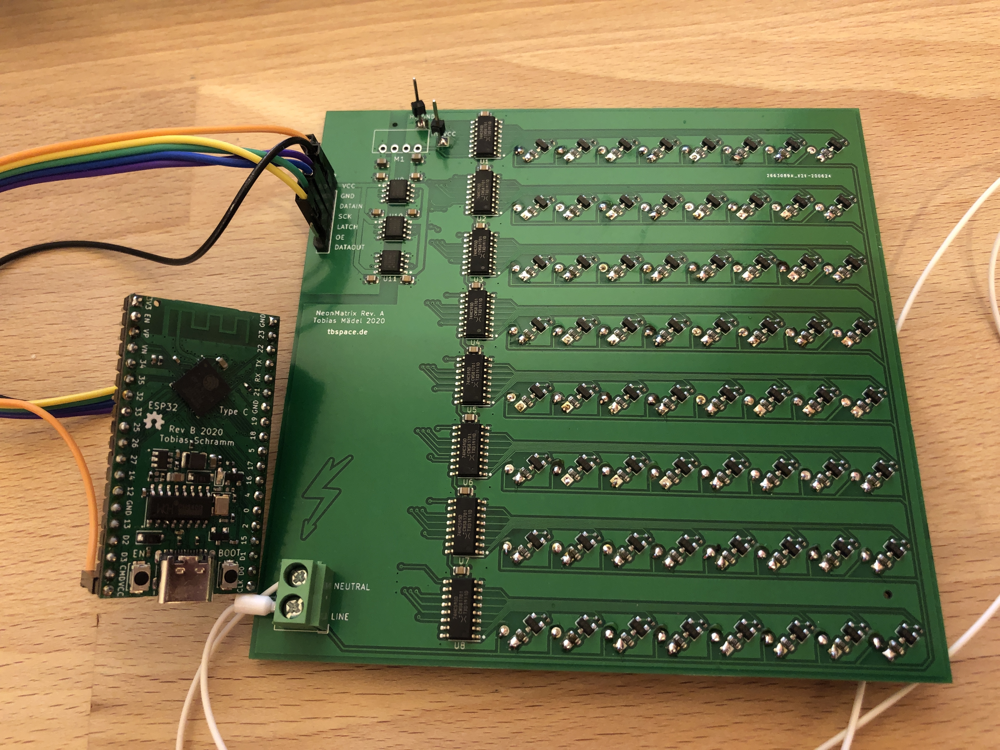
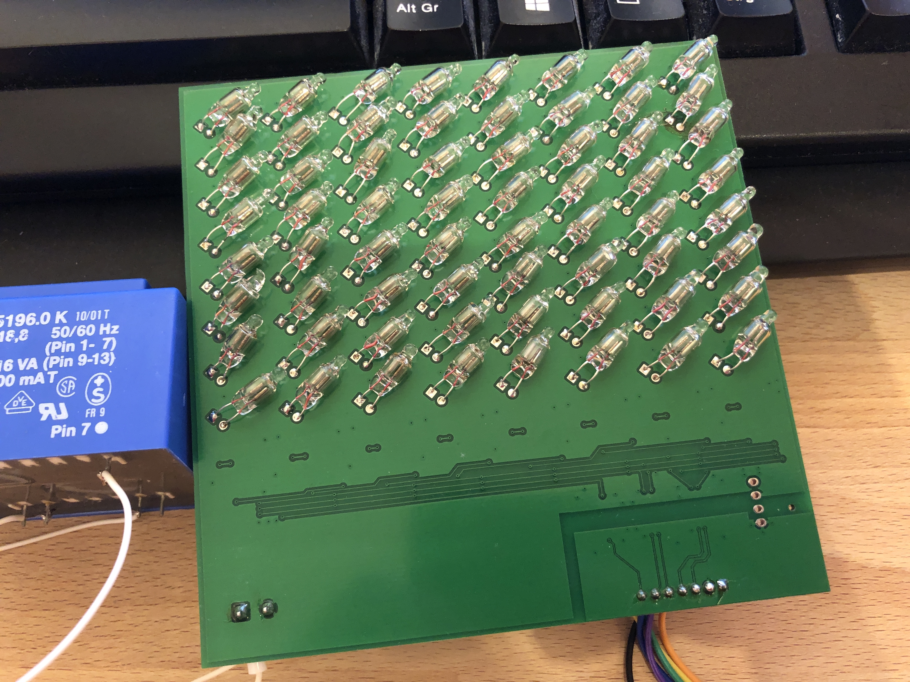

NeonMatrix
=============================

#### Overview

The NeonMatrix 8x8 matrix uses common neon indicator bulbs to display simple graphics.  
They can be chained and controlled directly via SPI.  

Operating voltage is about ~70V AC.  
The circuit is **pretty dangerous**, all neon bulbs have high voltages on their legs, the 74HC595 shift registers are floating at mains/AC potential.  
Safe data in/output is realized through 3 ADUM1200 digital isolator ICs and one B0505S DC-DC isolating converter. 

#### Additional info

[Firmware](https://github.com/Manawyrm/NeonMatrix-Firmware)  
[Schematic](https://github.com/Manawyrm/NeonMatrix/blob/master/Schematic.pdf)  